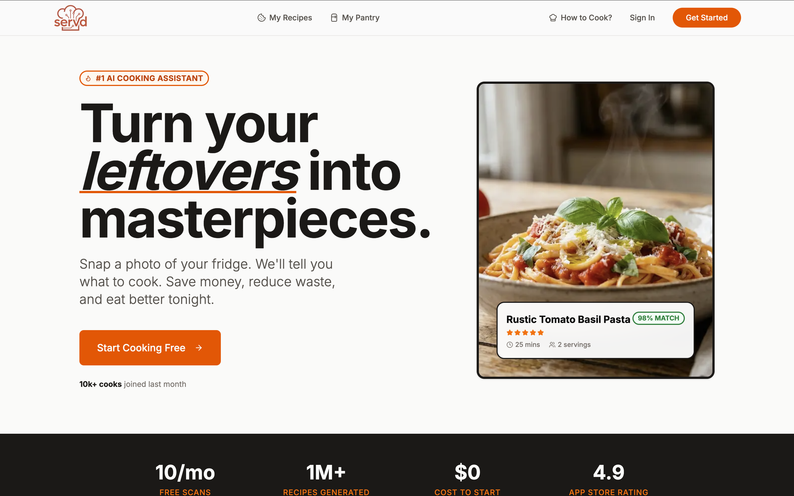
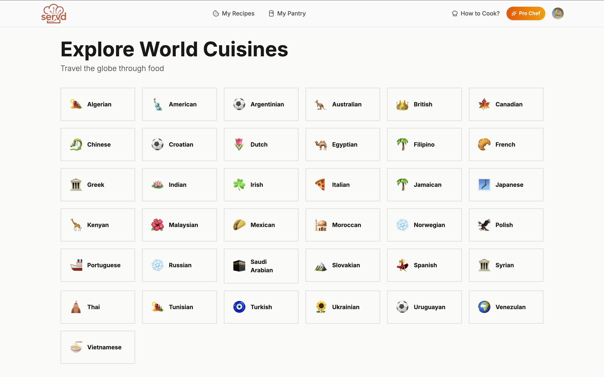
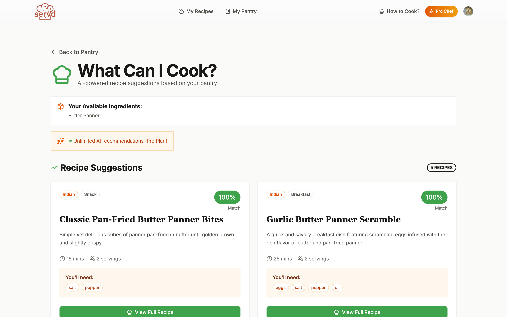

# 🍽️ Servd – AI Recipes Platform

<p align="center">
  
  
  <a href="LICENSE">
    
  </a>
</p>

<p align="center">
  <strong>Servd</strong> is a full-stack AI-powered recipe platform that helps users discover, generate, and manage recipes using modern web technologies, AI, and smart pantry-based suggestions.
</p>

<p align="center">
  <a href="https://ai-recipe-platform-gray.vercel.app/">🌐 Live Demo</a> •
  <a href="https://github.com/Dharmendra-07/ai-recipe-platform">📦 GitHub Repo</a>
</p>

---

## ✨ Features
- 🔐 User authentication (Clerk)
- 🤖 AI-generated recipes
- 🥗 Pantry-based recipe suggestions
- 📸 AI Pantry Scanner
- 🧠 Headless CMS (Strapi)
- 🧾 Save & manage recipes
- 🔎 Advanced recipe search
- ⚡ Rate limiting & bot protection (Arcjet)
- 💳 Subscription & pricing system
- 📄 PDF recipe downloads
- 🎨 Modern UI with Shadcn UI + Tailwind
- 🚀 Deployed on Vercel

---

## 🛠️ Tech Stack

### Frontend
- **Next.js (App Router)**
- **React**
- **Tailwind CSS**
- **Shadcn UI**
- **Lucide Icons**

### Backend
- **Next.js Server Actions**
- **Strapi (Headless CMS)**
- **PostgreSQL / SQL Database**

### Auth & Security
- **Clerk Authentication**
- **Arcjet (Rate limiting, Shield, Bot protection)**

### AI
- **AI Recipe Generation**
- **AI Pantry Scanner**
- **AI-based Suggestions**

---

## 🖼️ Screenshots

### Landing Page


### Explore Recipes


### AI Recipe Page


### Pantry Scanner


> 📌 Screenshots are stored in `frontend/public/`.

---

## ⚙️ Installation & Setup

### 1️⃣ Clone the repository
```bash
git clone https://github.com/Dharmendra-07/ai-recipe-platform.git
cd ai-recipe-platform
````

### 2️⃣ Install dependencies

```bash
npm install
```

### 3️⃣ Setup environment variables

```env
NEXT_PUBLIC_CLERK_PUBLISHABLE_KEY=
CLERK_SECRET_KEY=
DATABASE_URL=
STRAPI_API_URL=
ARCJET_KEY=
```

### 4️⃣ Run the project

```bash
npm run dev
```

---

## 🚀 Deployment

* ⚡ Frontend deployed on **Vercel**
* 🧠 Headless CMS powered by **Strapi**
* 🔐 Secured with **Clerk** and **Arcjet**
* ✅ Production-ready with AI, payments & rate limiting

---

## 👨‍💻 Author

**Dharmendra Kumar**
GitHub: [https://github.com/Dharmendra-07](https://github.com/Dharmendra-07)
Built with ❤️ using Next.js, AI & modern web tooling

---

## 📜 License

This project is licensed under the **MIT License**.
See the [LICENSE](LICENSE) file for details.

---

⭐ If you like this project, don’t forget to **star the repo**!

```

You’re good to go 🚀  
If you want a **shorter version** or a **portfolio-only README**, I can do that too.
```
